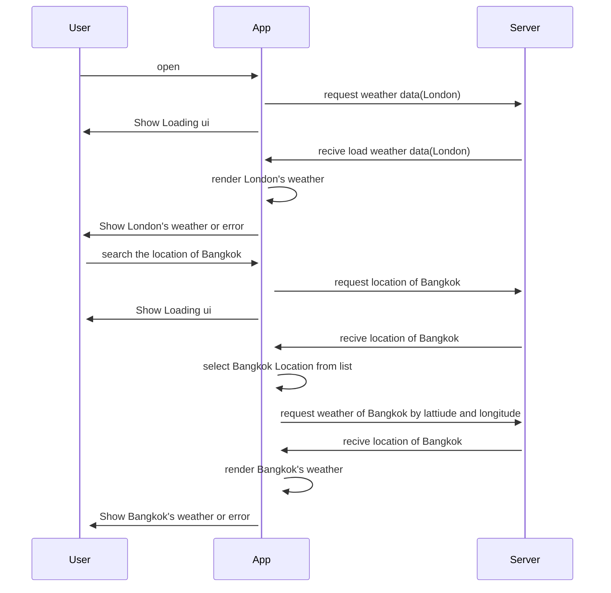

# Weather App
* weather app demo clip : https://drive.google.com/file/d/1_Y-jZ8AROF68GurHA8vkQGrw3oKQJIpa/view?usp=sharing

High level Architecture
------------
* MVVM
  * Viewmodel handles business logic and also hold data and UI State.
  * A Weather Repository was injected into the view model.
  * I used unidirectional flow pattern to handle the UI state. That was made the application has good maintain ability.

* Tech Stack
  * Kotlin
  * Jetpack Compose 
  * Retrofit 
  * Kotlin Coroutines 
  * StateFlow 
  * Hilt: For Dependency Injection

* State management work flow
  * Weather App Sequence diagram

  

